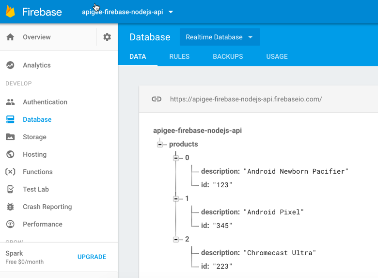

apigee-firebase-nodejs-express-api
==================================

Run and Deploy
======
#### Run locally
```bash
$ npm install
```

#### Deploy to Apigee Edge

To deploy this API Proxy to Edge, make sure apigeetool is installed in your machine.
```bash
apigeetool deploynodeapp -n apigee-firebase-nodejs-express-ap
i -d . -m index.js -o testmyapi -e test -b /apigee-firebase-nodejs-express-api -u $ae_username -p $
ae_password -V
```

Run
===
```bash
$ apiKey={GET_FROM_FIREBASE_CONSOLE}
 authDomain={GET_FROM_FIREBASE_CONSOLE} databaseURL={GET_FROM_FIREBASE_CONSOLE} projectId={GET_FROM_FIREBASE_CONSOLE} messagingSende
rId={GET_FROM_FIREBASE_CONSOLE} node index.js
```
Test
====

#### Create Records in Firebase

```javascript
app.post('/products', function (req, res) {
  var ref = firebase.database().ref('/products');
  var obj = [{
      id: "123",
      description: "Android Newborn Pacifier"
    },
    {
      id: "345",
      description: "Android Pixel"
    },
    {
      id: "223",
      description: "Chromecast Ultra"
    }
  ];
  res.send(ref.push(obj)); // Creates a new ref with a new "push key"
  ref.set(obj); // Overwrites the path
  ref.update(obj); // Updates only the specified attributes
})
```

Execute this command:
```bash
curl -X POST http://localhost:3000/products

curl -X POST http://testmyapi-test.apigee.net/apigee-firebase-nodejs-express-api/products -d ''

**Empty body, so Edge doesn\'t complain.**

```


#### Read records from Firebase

```bash
$ curl -X GET http://localhost:3000/products

Returns:

[{"description":"Android Newborn Pacifier","id":"123"},{"description":"Android Pixel","id":"345"},{"description":"Chromecast Ultra","id":"223"}]

#### Test in Edge
$ curl -X GET http://testmyapi-test.apigee.net/apigee-firebase-nodejs-express-api/products
```

#### How to configure environment variables in Edge for Node.js
You noticed that there in order to protect from leaking credentials in your source code, we used process.env variables as below. In order to set these variable, it is recommended to leverage EnvironmentVariables from TargetEndpoint as below.

```javascript
var config = {
  apiKey: process.env.apiKey,
  authDomain: process.env.authDomain,
  databaseURL: process.env.databaseURL,
  storageBucket: process.env.storageBucket,
  messagingSenderId: process.env.messagingSenderId
};
```

```xml
<?xml version="1.0" encoding="UTF-8" standalone="yes"?>
<TargetEndpoint name="default">
    <ScriptTarget>
        <EnvironmentVariables>
            <EnvironmentVariable name="apiKey">{REPLACE_ME}</EnvironmentVariable>
            <EnvironmentVariable name="authDomain">{REPLACE_ME}</EnvironmentVariable>
            <EnvironmentVariable name="databaseURL">{REPLACE_ME}</EnvironmentVariable>
            <EnvironmentVariable name="projectId">{REPLACE_ME}</EnvironmentVariable>
            <EnvironmentVariable name="messagingSenderId">{REPLACE_ME}</EnvironmentVariable>
        </EnvironmentVariables>
        <ResourceURL>node://index.js</ResourceURL>
    </ScriptTarget>
</TargetEndpoint>
```